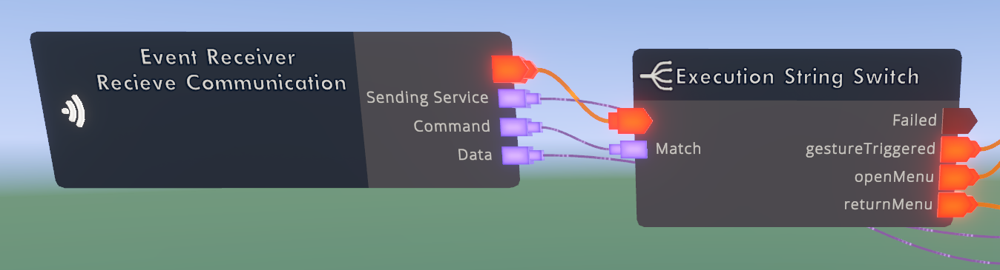

# Noxis Developer Info

Noxis's Developer Info system is a way to display warnings and errors when looking at a Noxis Service with Maker Pen.

<figure><figcaption></figcaption></figure>

In Developer Info's default state, it is connected to [noxis-prerequisites.md](noxis-prerequisites.md "mention"), taking errors and warnings from it.

Errors are formatted in a list, and split into 2 parts, divided by the `` ` `` symbol. The first part is a number ID, corresponding to the icon of the error, with different number values doing different things. These number values are:

* 0, a warning symbol
* 1, an error symbol

If multiple errors are found, the icon will take that of the highest error (error > warning,) and stack the errors in a list.

If you give an empty element of a list, it is automatically stripped out.

A **Show Errors** port is given to improve performance. Developer Info can take a solid amount of CV2 processing, and is not recommended to run all the time!
